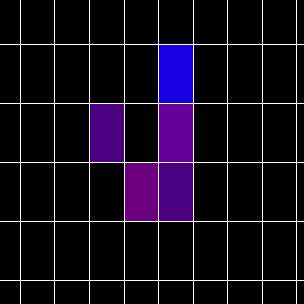
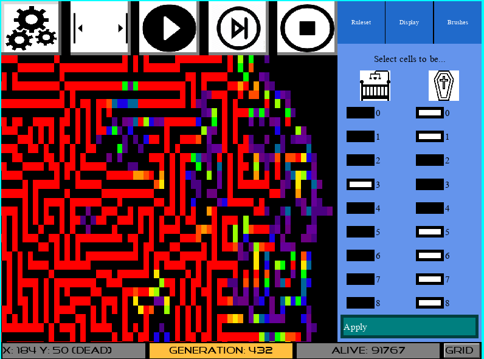
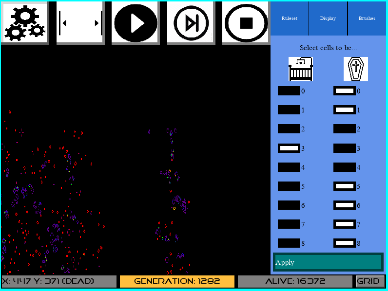
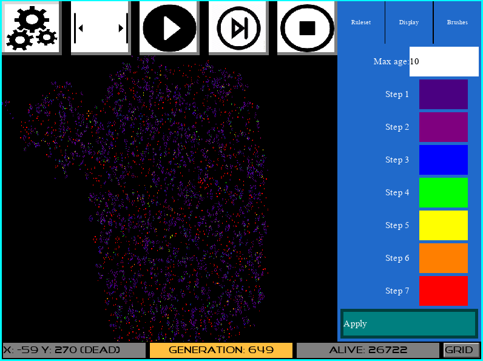
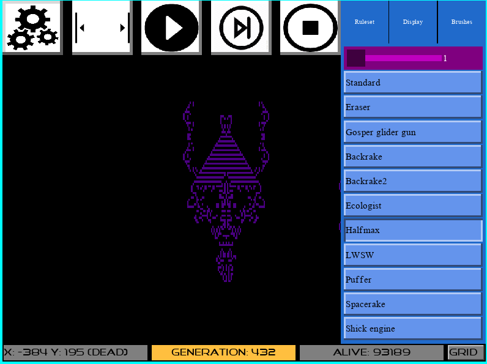

# cellular_automaton

Contains an implementation of a cellular automaton. Not very original but that's like something everyone has to do. The implementation allows for infinitely expanding grid and a lot of configuration to make it appealing.

# Installation

- Clone the repo: `git clone git@github.com:Knoblauchpilze/cellular_automaton.git`.
- Clone dependencies:
    * [core_utils](https://github.com/Knoblauchpilze/core_utils)
    * [maths_utils](https://github.com/Knoblauchpilze/maths_utils)
    * [sdl_engine](https://github.com/Knoblauchpilze/sdl_engine)
    * [sdl_core](https://github.com/Knoblauchpilze/sdl_core)
    * [sdl_graphic](https://github.com/Knoblauchpilze/sdl_graphic)
    * [sdl_app_core](https://github.com/Knoblauchpilze/sdl_app_core)
- Go to the project's directory `cd ~/path/to/the/repo`.
- Compile: `make r`.
- Install: `make install`.

Don't forget to add `/usr/local/lib` to your `LD_LIBRARY_PATH` to be able to load shared libraries at runtime.

# Usage

The application is composed of a single window having a visual representation of a colony along with some configuration properties. The configuration allow to change the ruleset to use to make cells evolve along with some coloring properties and finally a brush selection which allows to paint some cells using a specific pattern.
Brush can be added by the user if needed using a formalism defined in the [brushes](https://github.com/Knoblauchpilze/cellular_automaton/tree/master/data/brushes) directory.
The user can start or stop the simulation using the `Space` bar (or using the control defined in the menu bar) and pan to move to specific area of the colony. The user can also choose to randomize the cells defined in the colony.
Note that internally the colony is executed through some blocks of a certain size so the randomize operation only affects currently active blocks.

# Features

The user has several options to control the way the colony is displayed. Some are registered in the right panels and some are displayed in the status bar. The user can know the age of the cell pointed at by the mouse and activate a grid to help have a notion of the scale of the colony. Note that the grid automatically adapts its scale to the visible area of the colony so that we don't just draw a completely blank screen when a lot of cells are displayed.
The main state of the simulation can either be `running` or `stopped` which is triggered by the self-explanatory buttons. The user can also advance of a single step if needed.
Information about the current generation and the number of alive cells is displayed in the status bar.

## Ruleset view

Allows to define the ruleset to use to make the colony evolve. One can choose the number of cells allowing a cell to be born or to die. Checking boxes hopefully are self-explanatory with pretty cute icons :heart_eyes:
The ruleset is only applied when the user clicks on `Apply` and if the simulation is stopped.

## Color view

Allow to change the colors of cells. By default cells are colored with repsect to their age with some nice gradient when the age does not exactly fit on a specific value. The palette allows to define 7 steps where step 1 corresponds to a newborn cell and step 7 to a cell having the specified max age. Any cell older than this is assigned this color as well. Any dead cell is colored black.
The user can change the color associated to a specific step by rotating the colors using the palette provided. The color cycles when the end of the palette is reached.
The colors are applied when the user clicks on `Apply` and if the simulation is stopped.

## Brush view

Allows to select a brush that can then be displayed in the rendering view as an overlay using the `o` (as overlay) key. The brush will be painted centered on the mouse which might not always be exact in case the brush as odd dimensions. There's a preset of brushes available with names that can be googled for more information.
The `Standard` and `Erase` brush are affected by the brush size which can range from `1` to `10` and displays a solid patch of either live or dead cells.
The brush is painted on the colony only if the simulation is stopped.
